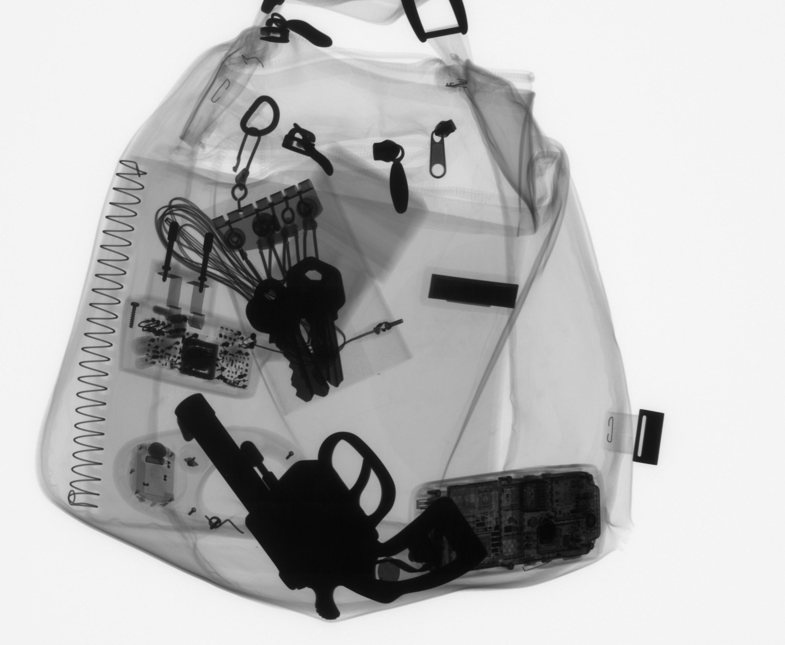

# Detector_GDXray
This repository contains 4 detectors for use in the detection of dangerous elements in X-ray images.
The repositories of the detectors used are the following:

  + [Yolov2](https://github.com/experiencor/keras-yolo2)
  + [Yolov3](https://github.com/experiencor/keras-yolo3)
  + [SSD300 y SSD7](https://github.com/pierluigiferrari/ssd_keras)
  + [RetinaNet](https://github.com/fizyr/keras-retinanet)

To start using the detectors you just have to clone or download the repository and follow the instructions in the Readme.

# Requirement
To install the dependencies, run

`pip3 install -r requirements.txt`

And if you want use the GPU to work, make sure you've got the drivers installed beforehand (CUDA).

It has been tested to work with Python 3.6.8.

# 0- Data GDXray
The database to use the public database GDXray which we can download from [GDXray](https://domingomery.ing.puc.cl/material/gdxray/), specifically you must create the "Data" folder and copy the folders B0049, B0051, B0052, B0076, B0082 and BX_100 (new folder) from GDXray. For the testing use the folder B0046 with its annotation, you can also download these folders in the following link :
[Data Link](https://drive.google.com/drive/folders/1edU-QUHdrRY6-xgmeL0WIvb8PiH9xRHz?usp=sharing).

Example image test:

# 1- Use Trained Model
## Download the pre trained weights
 First you must download the pre-trained weights in Imagenet given in the following link [Pre-Trained Weights](https://drive.google.com/open?id=19rYT577UqQwdJ4sNeq240c_X0NK3d1kB) and place them in their respective folders.

### Download Weights Trained Model
You can use already trained models to use directly in X-ray images to detect "Gun, Knife, Razor and Shuriken", for this create the "Weights Trained Model" folder in the repository folder and download the weights in the folder [Weights Trained Model](https://drive.google.com/open?id=13oyOlrYvLaIBY5YvCZiLtVtM_pQgYlA9).
Follow the following commands for detection:

+ `python predict_yolo2.py -c config_full_yolo2_infer.json -i input_path/folder -o save/folder/detection` Yolov2
+ `python predict_yolo3.py -c config_full_yolo3_infer.json -i input_path/folder -o save/folder/detection` Yolov3
+ `python predict_ssd.py -c config_7_infer.json -i input_path/folder -o save/folder/detection` SSD7
+ `python predict_ssd.py -c config_300_infer.json -i input_path/folder -o save/folder/detection` SSD300
+ `python predict_retinanet.py -c config_resnet50_infer.json -i input_path/folder -o save/folder/detection` RetinaNet

Example Detection:

+ `python predict_yolo2.py -c config_full_yolo2_infer.json -i Data/Testing/images/B0046_0001.png -o Example_yolo2/`
+ `python predict_retinanet.py -c config_resnet50_infer.json -i Data/Testing/images/B0046_0001.png -o Example_retinanet/`

# 2- Create own Data set for Training

To create a database to train detection models, you must run the command `python Create_Data_Superimpose.py`, if you want to modify the amount of data you must modify the parameters of the file `Create_Data_Superimpose.py`

You can also download a instance experiment 0 in the following link :[Experiment_0](https://drive.google.com/drive/folders/1aY2bMXvZ7qYl16NE7bo0yLseahbfJAql?usp=sharing).

Example image created:

# 3- Training

 ## Run Training
 Following commands for Trainig:

+ `python train_yolo2.py -c config_full_yolo2.json` Yolov2
+ `python train_yolo3.py -c config_full_yolo3.json` Yolov3
+ `python train_ssd.py -c config_7.json` SSD7
+ `python train_ssd.py -c config_300.json` SSD300
+ `python train_retinanet.py -c config_resnet50.json` RetinaNet

To change the folders used for training and the parameters of this, you must modify the configuration file `.json`.

 ## Suggestion
 If your computer does not have a GPU, it is recommended to only train the SSD7 model, due to the computation time that the other models need.

# 4- Evaluate
For evaluate the trained models just need specify the test folder with respective annotation in the configuration file `json`.

 ## Run Evaluate
 Following commands for Evaluate:
 + `python evaluate_yolo2.py -c config_full_yolo2.json` Yolov2
 + `python evaluate_yolo3.py -c config_full_yolo3.json` Yolov3
 + `python evaluate_ssd.py -c config_7_infer.json` SSD7
 + `python evaluate_ssd.py -c config_300.json` SSD300
 + `python evaluate_retinanet.py -c config_resnet50.json` RetinaNet

The default configuration have folder B0046 as folder test.

# 5- Usage your Models
For use your trained models to detect, follow the same structure that in section 1.

+ `python predict_yolo2.py -c config_full_yolo2.json -i input_path/folder -o save/folder/detection` Yolov2
+ `python predict_yolo3.py -c config_full_yolo3.json -i input_path/folder -o save/folder/detection` Yolov3
+ `python predict_ssd.py -c config_7.json -i input_path/folder -o save/folder/detection` SSD7
+ `python predict_ssd.py -c config_300.json -i input_path/folder -o save/folder/detection` SSD300
+ `python predict_retinanet.py -c config_resnet50.json -i input_path/folder -o save/folder/detection` RetinaNet

# Contributions
Show a way to use the limited GDXray database to create a database suitable for training the presented detectors. Also simplify the use of different detectors based on the repositories mentioned.

# Research dangerous objects detection (Daniel Saavedra)
the investigation can be replicated using the same code as Experiment 0, only line 101 must be changed in `Create_Data_Superimpose.py`:
`num_image_per_baggage = 200`.
Then the training and testing of the different models is performed as explained above.
